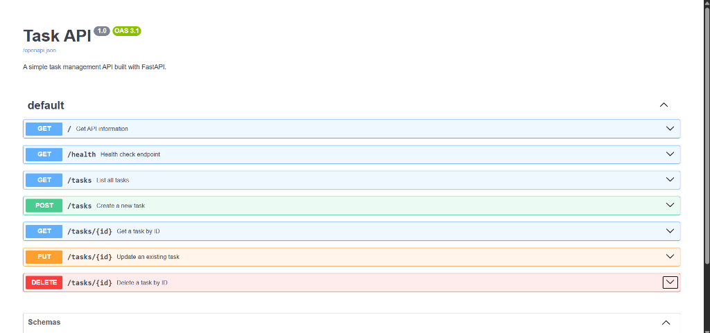

# Task API (BE-01)

A clean, RESTful CRUD API built with **FastAPI** and **Python** for task management.

---

## 📌 Project Overview

This API manages a collection of tasks in memory with full **CRUD** (Create, Read, Update, Delete) capability, HTTP status code management, input validation, and interactive OpenAPI (Swagger UI) documentation.

---

## 🚀 Quick Start (Install & Run)

### 1. Prerequisites
- Python 3.8+
- `pip` package manager

### 2. Installation
Install the necessary dependencies:
```bash
pip install fastapi uvicorn watchfiles
```

### 3. Run the Server
From this directory (`BE -01`), launch the Uvicorn server:
```bash
uvicorn main:app --reload
```
> The API will be live at `http://127.0.0.1:8000`

---

## 📑 API Endpoints Summary

| Method | Endpoint | Description | Success Status | Error Status |
| :--- | :--- | :--- | :---: | :---: |
| `GET` | `/` | Returns API metadata and version | `200 OK` | — |
| `GET` | `/health` | Server health check endpoint | `200 OK` | — |
| `GET` | `/tasks` | Retrieves all task items | `200 OK` | — |
| `GET` | `/tasks/{id}` | Retrieves a single task by ID | `200 OK` | `404 Not Found` |
| `POST` | `/tasks` | Creates a new task (`{"title": "..."}`) | `201 Created` | `400 Bad Request` |
| `PUT` | `/tasks/{id}` | Updates task `title` and/or `done` status | `200 OK` | `400 Bad Request`, `404 Not Found` |
| `DELETE` | `/tasks/{id}` | Deletes a task by ID | `204 No Content` | `404 Not Found` |

---

## 💻 Sample `curl -i` Command & Response Output

### 1. `GET /tasks/1` (Read Task)
```bash
curl -i http://127.0.0.1:8000/tasks/1
```
**Output:**
```http
HTTP/1.1 200 OK
date: Sat, 25 Jul 2026 01:15:00 GMT
server: uvicorn
content-length: 51
content-type: application/json

{"id":1,"title":"Buy groceries","done":false}
```

### 2. `POST /tasks` (Create Task)
```bash
curl -i -X POST http://127.0.0.1:8000/tasks \
  -H "Content-Type: application/json" \
  -d "{\"title\": \"Buy milk\"}"
```
**Output:**
```http
HTTP/1.1 201 Created
date: Sat, 25 Jul 2026 01:15:05 GMT
server: uvicorn
content-length: 44
content-type: application/json

{"id":4,"title":"Buy milk","done":false}
```

### 3. `GET /tasks/99` (404 Error Handling)
```bash
curl -i http://127.0.0.1:8000/tasks/99
```
**Output:**
```http
HTTP/1.1 404 Not Found
date: Sat, 25 Jul 2026 01:15:10 GMT
server: uvicorn
content-length: 29
content-type: application/json

{"error":"Task 99 not found"}
```

---

## 🎨 Interactive API Documentation (Swagger UI)

FastAPI automatically generates interactive Swagger documentation available at:
👉 **[http://127.0.0.1:8000/docs](http://127.0.0.1:8000/docs)**


